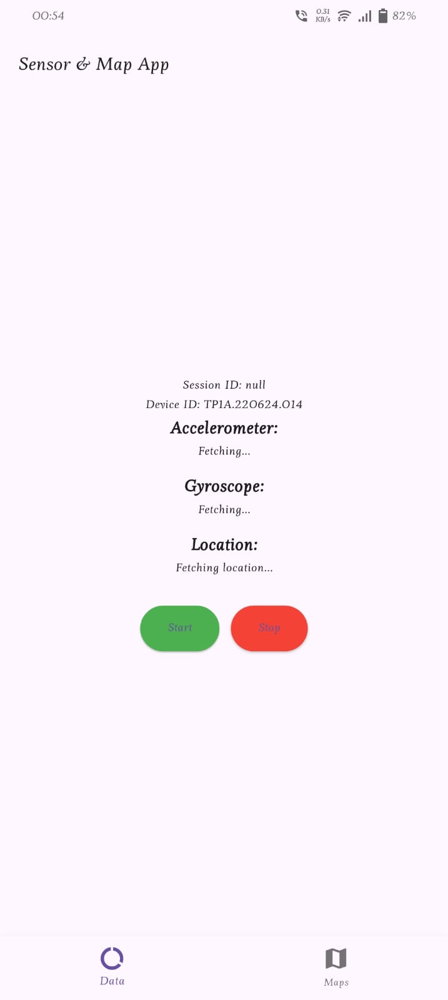
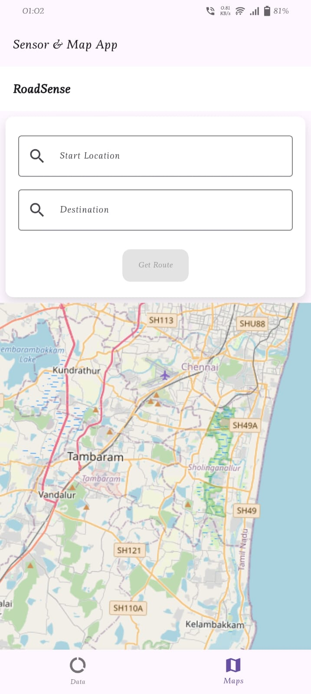
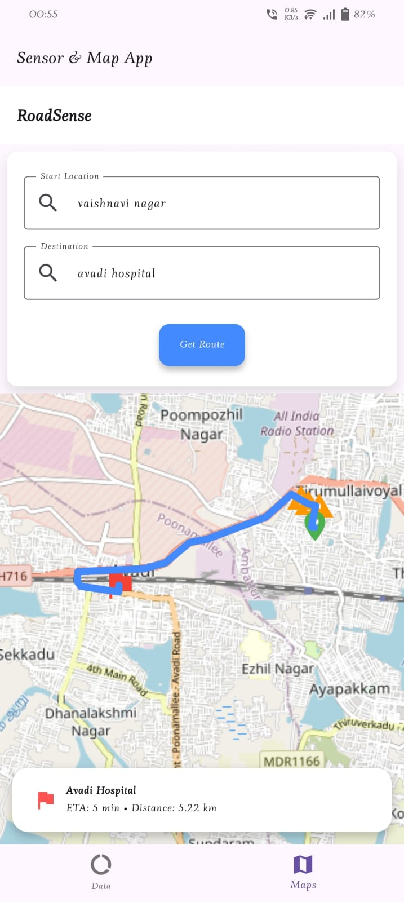
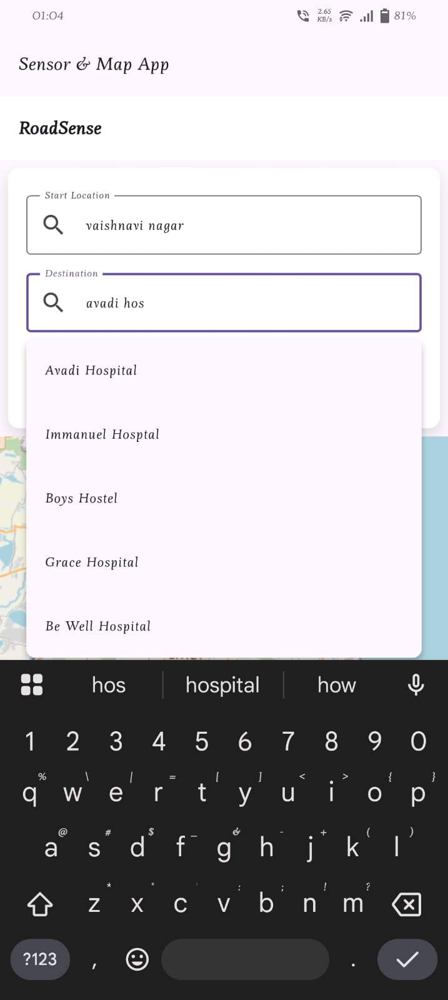
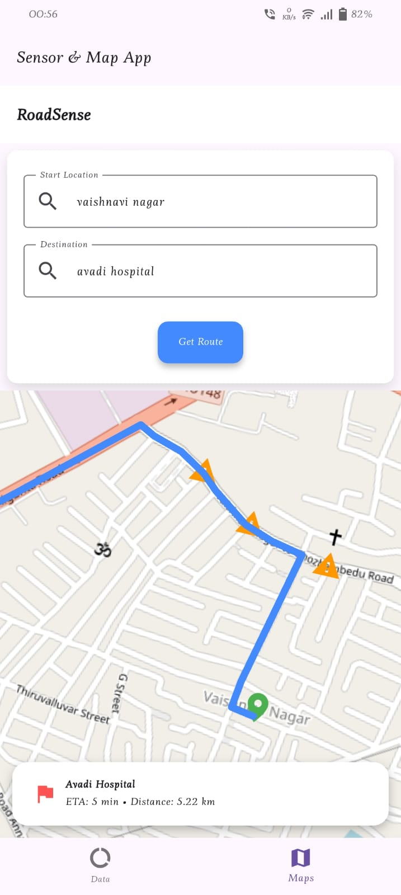

# RoadSense – Drive Safe with Real-Time Road Warnings

**RoadSense** is a mobile navigation application built with Flutter that helps
users navigate roads safely and efficiently. The primary goal of the app is to
**warn drivers about upcoming obstacles**, such as **speed breakers and
potholes**, along their route. In addition to real-time route planning, the app
enhances road awareness using integrated APIs and technologies for a seamless
and accurate navigation experience.


## Features

- **Interactive Maps** using OpenStreetMap API
- **Autocomplete Search** using Photon API
- **Routing & Directions** powered by OSRM (Open Source Routing Machine)
- **Warn Drivers about upcoming obstacles**
- **Smooth UI** developed with Flutter 

## Technologies Used

- **OpenStreetMap API**: Provides map data and tiles for rendering interactive maps.
- **Photon API**: Used for autocomplete search to make location-based queries more efficient.
- **OSRM (Open Source Routing Machine)**: Provides fast routing and directions for users.
- **Flutter**: The mobile development framework used to build the app for both iOS and Android.

## Installation

1. Clone the repository:
   ```bash
    git clone https://github.com/Dhanush-777x/roadsense.git
   ```

2. Install the dependencies:
    ```bash
    flutter pub get
    ```

3. Run the App:
    ```bash
    flutter run
    ```

## Screenshots

Here are some screenshots of the app in action:

<div align="center">
  
  
  
  

  <br><br>

  
  

</div>


